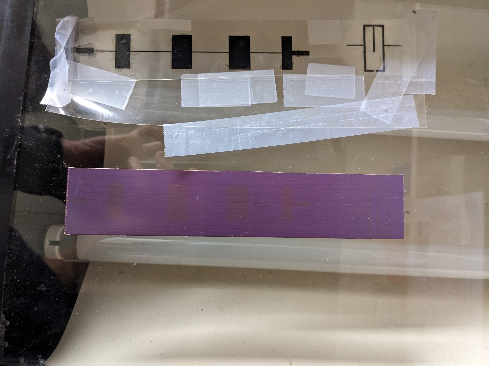
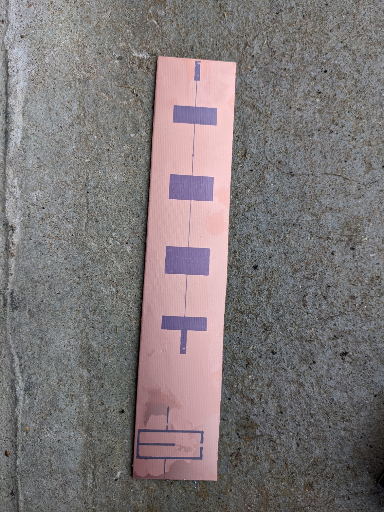

# Journal de fabrication de PCB

## Objectif

Mettre à jour ce fichier à chaque tentative de fabrication de PCB. Décrire les modifications au protocole apportées, les observations faites, les résultats, les choses potentielles à améliorer. Si possible mettre des photos.

## Journal

### Date : Jeudi 03 mars 2022

Fait :

impréssion sur papier calque
temps dans l’insoleuse UV : 4 minutes
temps dans la solution de révélation (au sodium) : 15 minutes
Perclo pas frais mais pas vert donc doit fonctionner
echecs -> au bout de 10 min aucun changement sur le PCB sauf là où le verni à été rayé auparavant.

A faire : 

prévoir des gants 
augmenter le temps d'exposition aux UV
changer la solution de révélation

### Date : Lundi 07 mars 2022

impression sur papier semi-transparent
superpisition de deux impressions pour augmenter le contraste
temps dans l'insoleuse UV : 10 minutes
temps dans la solution de révélation : 3 minutes en frottant avec un gant

résultat : echecs.
Après révélation, la distinction des pads du CI ne peut se faire -> Feuille pas assez transparente pour que les UVs délimite clairement les pads.
Une fois dans le perchlo, on y observe un manque d'agréssivité -> Perchlo trop vieux

### Date : Mercredi 09 mars 2022

impression sur papier transparent et imprimante laser (avec Yann Mahé)
superpisition de deux impressions pour augmenter le contraste
temps dans l'insoleuse UV : 10 minutes
temps dans la solution de révélation : 4 minutes en frottant doucement avec un gant. A la fin on y observe plus de "granulé" que l'on pense être des marques de résines. On y observe clairement la distinction des pads.

Mise dans le perchlo pendant 8 minutes chauffé à 49°C au bain marie. Le perchlo utilisé était dilué à 26% (26% de perchlo et le reste d'eau)
Résultat très satisfaisant. Le CI est parfaitement délimité.

|  |  |  |
| ------------------------------------- | --------------------------------------- |--------------------------------------------- |
| illustration_calque                  | PCB_dans_perchlo                    | PCB_finaux                    |

### Date : Jeudi 12 mai 2022

impression sur papier transparent et imprimante laser (avec Yann Mahé)
PAS de superposition de deux impressions
temps dans l'insoleuse UV : 11 minutes
temps dans la solution de révélation :  minutes
Solution de révélation : 5g de et 100ml d'eau.

### Date mercredi 18 octobre 2023

impression sur papier transparant et imprimante jet d'encre (chez dudu) imprimante mode monochrome, papier glacé, très bonne qualité
superposition de deux calques
temps dans l'insoleuse UV : 10 min
Note : à la sortie, on distingue les motifs du PBCs et des traces violettes sur le cuivre

temps dans la solution de révélation : 4 min

Une fois dans le perchlo, on observe que les pistes ont commencées à ête "manger". Cela serait dû à une sur exposition aux UV (trop longtemps dans l'insoleuse). La raison de ce temps trop longtemps dans l'insoleuse est dû au fait que le calque ne présente pas assez de contraste (entre les pistes et les endroits où il n'y a rien). 

Une solution serait de laisser moins longtemps dans l'insoleuse et/ou d'utiliser une imprimante laser plutôt qu'une imprimante jet d'encre.

|  |  |  |
| ------------------------------------- | ----------------------------------------- | ----------------------------------------- |
| PCB_apres_insolation                  | PCB_apres_revelation    |   PCB_apres_perchlo             |

